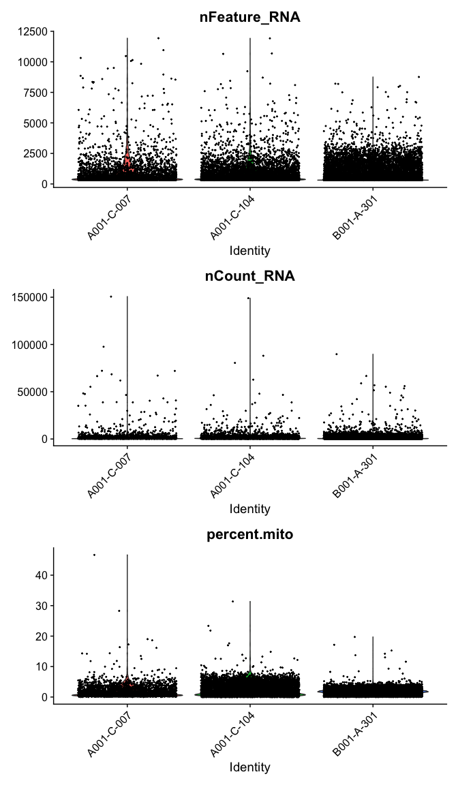
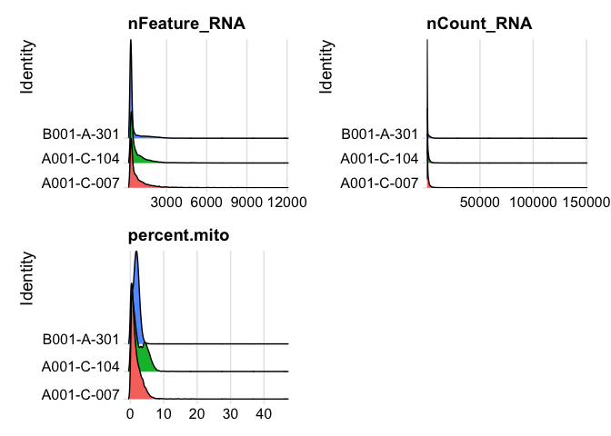
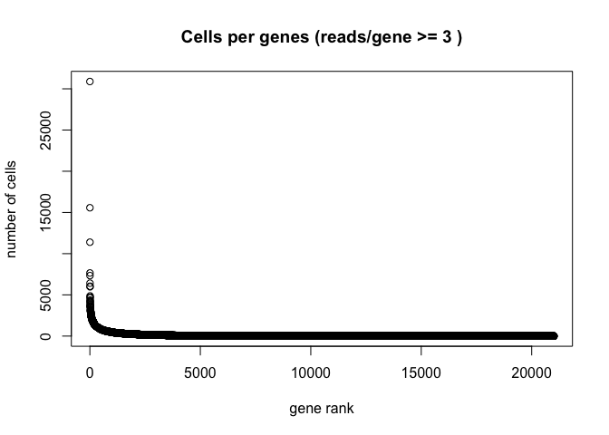
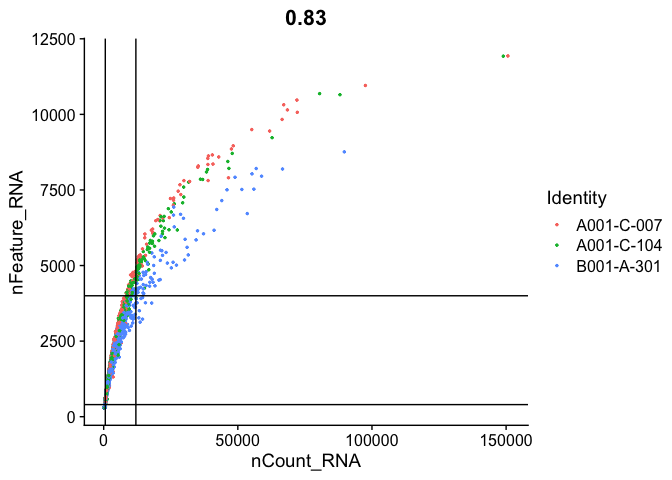

Last Updated: July 14, 2022

# Part 2: Some QA/QC, filtering and normalization

## Load libraries

```r
library(Seurat)
library(biomaRt)
library(ggplot2)
library(knitr)
library(kableExtra)
```

## Load the Seurat object from part 1

```r
load(file="original_seurat_object.RData")
experiment.aggregate
```

```
## An object of class Seurat 
## 21005 features across 30902 samples within 1 assay 
## Active assay: RNA (21005 features, 0 variable features)
```

```r
set.seed(12345)
```

## Some basic QA/QC of the metadata, print tables of the 5% quantiles.

Show 5% quantiles for number of genes per cell per sample

```r
kable(do.call("cbind", tapply(experiment.aggregate$nFeature_RNA, 
                      Idents(experiment.aggregate),quantile,probs=seq(0,1,0.05))),
      caption = "5% Quantiles of Genes/Cell by Sample") %>% kable_styling()
```

<table class="table" style="margin-left: auto; margin-right: auto;">
<caption>5% Quantiles of Genes/Cell by Sample</caption>
 <thead>
  <tr>
   <th style="text-align:left;">   </th>
   <th style="text-align:right;"> A001-C-007 </th>
   <th style="text-align:right;"> A001-C-104 </th>
   <th style="text-align:right;"> B001-A-301 </th>
  </tr>
 </thead>
<tbody>
  <tr>
   <td style="text-align:left;"> 0% </td>
   <td style="text-align:right;"> 298.0 </td>
   <td style="text-align:right;"> 297 </td>
   <td style="text-align:right;"> 298.00 </td>
  </tr>
  <tr>
   <td style="text-align:left;"> 5% </td>
   <td style="text-align:right;"> 306.0 </td>
   <td style="text-align:right;"> 308 </td>
   <td style="text-align:right;"> 302.00 </td>
  </tr>
  <tr>
   <td style="text-align:left;"> 10% </td>
   <td style="text-align:right;"> 315.0 </td>
   <td style="text-align:right;"> 321 </td>
   <td style="text-align:right;"> 304.00 </td>
  </tr>
  <tr>
   <td style="text-align:left;"> 15% </td>
   <td style="text-align:right;"> 325.0 </td>
   <td style="text-align:right;"> 336 </td>
   <td style="text-align:right;"> 307.00 </td>
  </tr>
  <tr>
   <td style="text-align:left;"> 20% </td>
   <td style="text-align:right;"> 339.0 </td>
   <td style="text-align:right;"> 351 </td>
   <td style="text-align:right;"> 310.00 </td>
  </tr>
  <tr>
   <td style="text-align:left;"> 25% </td>
   <td style="text-align:right;"> 356.0 </td>
   <td style="text-align:right;"> 367 </td>
   <td style="text-align:right;"> 312.00 </td>
  </tr>
  <tr>
   <td style="text-align:left;"> 30% </td>
   <td style="text-align:right;"> 380.0 </td>
   <td style="text-align:right;"> 385 </td>
   <td style="text-align:right;"> 316.00 </td>
  </tr>
  <tr>
   <td style="text-align:left;"> 35% </td>
   <td style="text-align:right;"> 406.0 </td>
   <td style="text-align:right;"> 406 </td>
   <td style="text-align:right;"> 319.00 </td>
  </tr>
  <tr>
   <td style="text-align:left;"> 40% </td>
   <td style="text-align:right;"> 437.0 </td>
   <td style="text-align:right;"> 430 </td>
   <td style="text-align:right;"> 323.00 </td>
  </tr>
  <tr>
   <td style="text-align:left;"> 45% </td>
   <td style="text-align:right;"> 482.0 </td>
   <td style="text-align:right;"> 465 </td>
   <td style="text-align:right;"> 327.00 </td>
  </tr>
  <tr>
   <td style="text-align:left;"> 50% </td>
   <td style="text-align:right;"> 534.0 </td>
   <td style="text-align:right;"> 515 </td>
   <td style="text-align:right;"> 332.00 </td>
  </tr>
  <tr>
   <td style="text-align:left;"> 55% </td>
   <td style="text-align:right;"> 616.0 </td>
   <td style="text-align:right;"> 574 </td>
   <td style="text-align:right;"> 338.00 </td>
  </tr>
  <tr>
   <td style="text-align:left;"> 60% </td>
   <td style="text-align:right;"> 701.6 </td>
   <td style="text-align:right;"> 645 </td>
   <td style="text-align:right;"> 345.00 </td>
  </tr>
  <tr>
   <td style="text-align:left;"> 65% </td>
   <td style="text-align:right;"> 787.0 </td>
   <td style="text-align:right;"> 737 </td>
   <td style="text-align:right;"> 355.00 </td>
  </tr>
  <tr>
   <td style="text-align:left;"> 70% </td>
   <td style="text-align:right;"> 916.0 </td>
   <td style="text-align:right;"> 869 </td>
   <td style="text-align:right;"> 373.00 </td>
  </tr>
  <tr>
   <td style="text-align:left;"> 75% </td>
   <td style="text-align:right;"> 1073.0 </td>
   <td style="text-align:right;"> 1013 </td>
   <td style="text-align:right;"> 429.00 </td>
  </tr>
  <tr>
   <td style="text-align:left;"> 80% </td>
   <td style="text-align:right;"> 1264.4 </td>
   <td style="text-align:right;"> 1179 </td>
   <td style="text-align:right;"> 550.00 </td>
  </tr>
  <tr>
   <td style="text-align:left;"> 85% </td>
   <td style="text-align:right;"> 1543.4 </td>
   <td style="text-align:right;"> 1413 </td>
   <td style="text-align:right;"> 868.00 </td>
  </tr>
  <tr>
   <td style="text-align:left;"> 90% </td>
   <td style="text-align:right;"> 1961.4 </td>
   <td style="text-align:right;"> 1778 </td>
   <td style="text-align:right;"> 1356.00 </td>
  </tr>
  <tr>
   <td style="text-align:left;"> 95% </td>
   <td style="text-align:right;"> 2871.9 </td>
   <td style="text-align:right;"> 2400 </td>
   <td style="text-align:right;"> 1979.35 </td>
  </tr>
  <tr>
   <td style="text-align:left;"> 100% </td>
   <td style="text-align:right;"> 11933.0 </td>
   <td style="text-align:right;"> 11925 </td>
   <td style="text-align:right;"> 8761.00 </td>
  </tr>
</tbody>
</table>

Show 5% quantiles for number of UMI per cell per sample

```r
kable(do.call("cbind", tapply(experiment.aggregate$nCount_RNA, 
                                      Idents(experiment.aggregate),quantile,probs=seq(0,1,0.05))),
      caption = "5% Quantiles of UMI/Cell by Sample") %>% kable_styling()
```

<table class="table" style="margin-left: auto; margin-right: auto;">
<caption>5% Quantiles of UMI/Cell by Sample</caption>
 <thead>
  <tr>
   <th style="text-align:left;">   </th>
   <th style="text-align:right;"> A001-C-007 </th>
   <th style="text-align:right;"> A001-C-104 </th>
   <th style="text-align:right;"> B001-A-301 </th>
  </tr>
 </thead>
<tbody>
  <tr>
   <td style="text-align:left;"> 0% </td>
   <td style="text-align:right;"> 320.0 </td>
   <td style="text-align:right;"> 316 </td>
   <td style="text-align:right;"> 317.00 </td>
  </tr>
  <tr>
   <td style="text-align:left;"> 5% </td>
   <td style="text-align:right;"> 343.0 </td>
   <td style="text-align:right;"> 347 </td>
   <td style="text-align:right;"> 341.00 </td>
  </tr>
  <tr>
   <td style="text-align:left;"> 10% </td>
   <td style="text-align:right;"> 356.0 </td>
   <td style="text-align:right;"> 363 </td>
   <td style="text-align:right;"> 346.00 </td>
  </tr>
  <tr>
   <td style="text-align:left;"> 15% </td>
   <td style="text-align:right;"> 369.0 </td>
   <td style="text-align:right;"> 381 </td>
   <td style="text-align:right;"> 350.00 </td>
  </tr>
  <tr>
   <td style="text-align:left;"> 20% </td>
   <td style="text-align:right;"> 385.0 </td>
   <td style="text-align:right;"> 400 </td>
   <td style="text-align:right;"> 353.00 </td>
  </tr>
  <tr>
   <td style="text-align:left;"> 25% </td>
   <td style="text-align:right;"> 407.0 </td>
   <td style="text-align:right;"> 422 </td>
   <td style="text-align:right;"> 357.00 </td>
  </tr>
  <tr>
   <td style="text-align:left;"> 30% </td>
   <td style="text-align:right;"> 436.0 </td>
   <td style="text-align:right;"> 444 </td>
   <td style="text-align:right;"> 361.00 </td>
  </tr>
  <tr>
   <td style="text-align:left;"> 35% </td>
   <td style="text-align:right;"> 469.0 </td>
   <td style="text-align:right;"> 468 </td>
   <td style="text-align:right;"> 366.00 </td>
  </tr>
  <tr>
   <td style="text-align:left;"> 40% </td>
   <td style="text-align:right;"> 508.0 </td>
   <td style="text-align:right;"> 500 </td>
   <td style="text-align:right;"> 370.00 </td>
  </tr>
  <tr>
   <td style="text-align:left;"> 45% </td>
   <td style="text-align:right;"> 564.7 </td>
   <td style="text-align:right;"> 543 </td>
   <td style="text-align:right;"> 376.00 </td>
  </tr>
  <tr>
   <td style="text-align:left;"> 50% </td>
   <td style="text-align:right;"> 640.0 </td>
   <td style="text-align:right;"> 606 </td>
   <td style="text-align:right;"> 382.00 </td>
  </tr>
  <tr>
   <td style="text-align:left;"> 55% </td>
   <td style="text-align:right;"> 740.0 </td>
   <td style="text-align:right;"> 685 </td>
   <td style="text-align:right;"> 389.00 </td>
  </tr>
  <tr>
   <td style="text-align:left;"> 60% </td>
   <td style="text-align:right;"> 856.6 </td>
   <td style="text-align:right;"> 783 </td>
   <td style="text-align:right;"> 399.00 </td>
  </tr>
  <tr>
   <td style="text-align:left;"> 65% </td>
   <td style="text-align:right;"> 992.8 </td>
   <td style="text-align:right;"> 912 </td>
   <td style="text-align:right;"> 411.00 </td>
  </tr>
  <tr>
   <td style="text-align:left;"> 70% </td>
   <td style="text-align:right;"> 1171.0 </td>
   <td style="text-align:right;"> 1098 </td>
   <td style="text-align:right;"> 432.00 </td>
  </tr>
  <tr>
   <td style="text-align:left;"> 75% </td>
   <td style="text-align:right;"> 1428.0 </td>
   <td style="text-align:right;"> 1328 </td>
   <td style="text-align:right;"> 501.00 </td>
  </tr>
  <tr>
   <td style="text-align:left;"> 80% </td>
   <td style="text-align:right;"> 1737.0 </td>
   <td style="text-align:right;"> 1590 </td>
   <td style="text-align:right;"> 662.00 </td>
  </tr>
  <tr>
   <td style="text-align:left;"> 85% </td>
   <td style="text-align:right;"> 2179.1 </td>
   <td style="text-align:right;"> 1991 </td>
   <td style="text-align:right;"> 1118.00 </td>
  </tr>
  <tr>
   <td style="text-align:left;"> 90% </td>
   <td style="text-align:right;"> 3026.2 </td>
   <td style="text-align:right;"> 2720 </td>
   <td style="text-align:right;"> 1970.40 </td>
  </tr>
  <tr>
   <td style="text-align:left;"> 95% </td>
   <td style="text-align:right;"> 5176.5 </td>
   <td style="text-align:right;"> 4213 </td>
   <td style="text-align:right;"> 3338.45 </td>
  </tr>
  <tr>
   <td style="text-align:left;"> 100% </td>
   <td style="text-align:right;"> 150669.0 </td>
   <td style="text-align:right;"> 148953 </td>
   <td style="text-align:right;"> 89690.00 </td>
  </tr>
</tbody>
</table>

Show 5% quantiles for number of mitochondrial percentage per cell per sample

```r
kable(round(do.call("cbind", tapply(experiment.aggregate$percent.mito, Idents(experiment.aggregate),quantile,probs=seq(0,1,0.05))), digits = 3),
      caption = "5% Quantiles of Percent Mitochondria by Sample") %>% kable_styling()
```

<table class="table" style="margin-left: auto; margin-right: auto;">
<caption>5% Quantiles of Percent Mitochondria by Sample</caption>
 <thead>
  <tr>
   <th style="text-align:left;">   </th>
   <th style="text-align:right;"> A001-C-007 </th>
   <th style="text-align:right;"> A001-C-104 </th>
   <th style="text-align:right;"> B001-A-301 </th>
  </tr>
 </thead>
<tbody>
  <tr>
   <td style="text-align:left;"> 0% </td>
   <td style="text-align:right;"> 0.000 </td>
   <td style="text-align:right;"> 0.000 </td>
   <td style="text-align:right;"> 0.000 </td>
  </tr>
  <tr>
   <td style="text-align:left;"> 5% </td>
   <td style="text-align:right;"> 0.245 </td>
   <td style="text-align:right;"> 0.247 </td>
   <td style="text-align:right;"> 0.180 </td>
  </tr>
  <tr>
   <td style="text-align:left;"> 10% </td>
   <td style="text-align:right;"> 0.340 </td>
   <td style="text-align:right;"> 0.402 </td>
   <td style="text-align:right;"> 0.297 </td>
  </tr>
  <tr>
   <td style="text-align:left;"> 15% </td>
   <td style="text-align:right;"> 0.418 </td>
   <td style="text-align:right;"> 0.543 </td>
   <td style="text-align:right;"> 0.491 </td>
  </tr>
  <tr>
   <td style="text-align:left;"> 20% </td>
   <td style="text-align:right;"> 0.504 </td>
   <td style="text-align:right;"> 0.703 </td>
   <td style="text-align:right;"> 0.748 </td>
  </tr>
  <tr>
   <td style="text-align:left;"> 25% </td>
   <td style="text-align:right;"> 0.597 </td>
   <td style="text-align:right;"> 0.856 </td>
   <td style="text-align:right;"> 0.946 </td>
  </tr>
  <tr>
   <td style="text-align:left;"> 30% </td>
   <td style="text-align:right;"> 0.699 </td>
   <td style="text-align:right;"> 1.024 </td>
   <td style="text-align:right;"> 1.130 </td>
  </tr>
  <tr>
   <td style="text-align:left;"> 35% </td>
   <td style="text-align:right;"> 0.812 </td>
   <td style="text-align:right;"> 1.222 </td>
   <td style="text-align:right;"> 1.292 </td>
  </tr>
  <tr>
   <td style="text-align:left;"> 40% </td>
   <td style="text-align:right;"> 0.931 </td>
   <td style="text-align:right;"> 1.425 </td>
   <td style="text-align:right;"> 1.418 </td>
  </tr>
  <tr>
   <td style="text-align:left;"> 45% </td>
   <td style="text-align:right;"> 1.068 </td>
   <td style="text-align:right;"> 1.686 </td>
   <td style="text-align:right;"> 1.542 </td>
  </tr>
  <tr>
   <td style="text-align:left;"> 50% </td>
   <td style="text-align:right;"> 1.245 </td>
   <td style="text-align:right;"> 1.976 </td>
   <td style="text-align:right;"> 1.676 </td>
  </tr>
  <tr>
   <td style="text-align:left;"> 55% </td>
   <td style="text-align:right;"> 1.422 </td>
   <td style="text-align:right;"> 2.345 </td>
   <td style="text-align:right;"> 1.774 </td>
  </tr>
  <tr>
   <td style="text-align:left;"> 60% </td>
   <td style="text-align:right;"> 1.624 </td>
   <td style="text-align:right;"> 2.836 </td>
   <td style="text-align:right;"> 1.913 </td>
  </tr>
  <tr>
   <td style="text-align:left;"> 65% </td>
   <td style="text-align:right;"> 1.863 </td>
   <td style="text-align:right;"> 3.297 </td>
   <td style="text-align:right;"> 2.020 </td>
  </tr>
  <tr>
   <td style="text-align:left;"> 70% </td>
   <td style="text-align:right;"> 2.164 </td>
   <td style="text-align:right;"> 3.792 </td>
   <td style="text-align:right;"> 2.151 </td>
  </tr>
  <tr>
   <td style="text-align:left;"> 75% </td>
   <td style="text-align:right;"> 2.493 </td>
   <td style="text-align:right;"> 4.199 </td>
   <td style="text-align:right;"> 2.286 </td>
  </tr>
  <tr>
   <td style="text-align:left;"> 80% </td>
   <td style="text-align:right;"> 2.871 </td>
   <td style="text-align:right;"> 4.582 </td>
   <td style="text-align:right;"> 2.439 </td>
  </tr>
  <tr>
   <td style="text-align:left;"> 85% </td>
   <td style="text-align:right;"> 3.306 </td>
   <td style="text-align:right;"> 5.000 </td>
   <td style="text-align:right;"> 2.604 </td>
  </tr>
  <tr>
   <td style="text-align:left;"> 90% </td>
   <td style="text-align:right;"> 3.869 </td>
   <td style="text-align:right;"> 5.542 </td>
   <td style="text-align:right;"> 2.841 </td>
  </tr>
  <tr>
   <td style="text-align:left;"> 95% </td>
   <td style="text-align:right;"> 4.798 </td>
   <td style="text-align:right;"> 6.266 </td>
   <td style="text-align:right;"> 3.176 </td>
  </tr>
  <tr>
   <td style="text-align:left;"> 100% </td>
   <td style="text-align:right;"> 46.647 </td>
   <td style="text-align:right;"> 31.370 </td>
   <td style="text-align:right;"> 19.728 </td>
  </tr>
</tbody>
</table>

Violin plot of 1) number of genes, 2) number of UMI and 3) percent mitochondrial genes

```r
VlnPlot(
  experiment.aggregate,
  features = c("nFeature_RNA", "nCount_RNA","percent.mito"),
  ncol = 1, pt.size = 0.3)
```

<!-- -->

plot ridge plots of the same data


```r
RidgePlot(experiment.aggregate, features=c("nFeature_RNA","nCount_RNA", "percent.mito"), ncol = 2)
```

<!-- -->

Plot the distribution of number of cells each gene is represented by.

```r
plot(sort(Matrix::rowSums(GetAssayData(experiment.aggregate) >= 3), decreasing = TRUE) , xlab="gene rank", ylab="number of cells", main="Cells per genes (reads/gene >= 3 )")
```

<!-- -->


Gene Plot, scatter plot of gene expression across cells, (colored by sample), drawing horizontal an verticale lines at proposed filtering cutoffs.


```r
FeatureScatter(experiment.aggregate, feature1 = "nCount_RNA", feature2 = "percent.mito", shuffle = TRUE) + geom_vline(xintercept = c(600,12000)) + geom_hline(yintercept = 8)
```

<!-- -->

```r
FeatureScatter(experiment.aggregate, feature1 = "nFeature_RNA", feature2 = "percent.mito", shuffle = TRUE) + geom_vline(xintercept = c(400,4000)) + geom_hline(yintercept = 8)
```

<!-- -->

```r
FeatureScatter(
  experiment.aggregate, "nCount_RNA", "nFeature_RNA",
  pt.size = 0.5, shuffle = TRUE)  + geom_vline(xintercept = c(600,12000)) + geom_hline(yintercept = c(400, 4000))
```

<!-- -->

### Cell filtering

We use the information above to filter out cells. Here we choose those that have percent mitochondrial genes max of 8%, unique UMI counts under 1,000 or greater than 12,000 and contain at least 700 features within them.


```r
table(experiment.aggregate$orig.ident)
```

```
## 
## A001-C-007 A001-C-104 B001-A-301 
##       3047       5881      21974
```

```r
experiment.aggregate <- subset(experiment.aggregate, percent.mito <= 8)

experiment.aggregate <- subset(experiment.aggregate, nCount_RNA >= 500 & nCount_RNA <= 12000)

experiment.aggregate <- subset(experiment.aggregate, nFeature_RNA >= 400 & nFeature_RNA < 4000)

experiment.aggregate
```

```
## An object of class Seurat 
## 21005 features across 10595 samples within 1 assay 
## Active assay: RNA (21005 features, 0 variable features)
```

```r
table(experiment.aggregate$orig.ident)
```

```
## 
## A001-C-007 A001-C-104 B001-A-301 
##       1774       3416       5405
```

Lets se the ridge plots now after filtering

```r
RidgePlot(experiment.aggregate, features=c("nFeature_RNA","nCount_RNA", "percent.mito"), ncol = 2)
```

<!-- -->
### You may also want to filter out additional genes.

When creating the base Seurat object we did filter out some genes, recall _Keep all genes expressed in >= 10 cells_. After filtering cells and you may want to be more aggressive with the gene filter. Seurat doesn't supply such a function (that I can find), so below is a function that can do so, it filters genes requiring a min.value (log-normalized) in at least min.cells, here expression of 1 in at least 400 cells.


```r
experiment.aggregate
FilterGenes <-
 function (object, min.value=1, min.cells = 0, genes = NULL) {
   genes.use <- rownames(object)
   if (!is.null(genes)) {
     genes.use <- intersect(genes.use, genes)
     object@data <- GetAssayData(object)[genes.use, ]
   } else if (min.cells > 0) {
     num.cells <- Matrix::rowSums(GetAssayData(object) > min.value)
     genes.use <- names(num.cells[which(num.cells >= min.cells)])
     object = object[genes.use, ]
   }
  object <- LogSeuratCommand(object = object)
  return(object)
}

experiment.aggregate.genes <- FilterGenes(object = experiment.aggregate, min.value = 1, min.cells = 400)
experiment.aggregate.genes
rm(experiment.aggregate.genes)
```

## Next we want to normalize the data

After filtering out cells from the dataset, the next step is to normalize the data. By default, we employ a global-scaling normalization method LogNormalize that normalizes the gene expression measurements for each cell by the total expression, multiplies this by a scale factor (10,000 by default), and then log-transforms the data.


```r
?NormalizeData
```


```r
experiment.aggregate <- NormalizeData(
  object = experiment.aggregate,
  normalization.method = "LogNormalize",
  scale.factor = 10000)
```

### Calculate Cell-Cycle with Seurat, the list of genes comes with Seurat (only for human)
[Dissecting the multicellular ecosystem of metastatic melanoma by single-cell RNA-seq](https://www.ncbi.nlm.nih.gov/pmc/articles/PMC4944528/)


```r
# this code is for human samples only!
s.genes <- (cc.genes$s.genes)
g2m.genes <- (cc.genes$g2m.genes)

experiment.aggregate <- CellCycleScoring(experiment.aggregate,
                                         s.features = s.genes,
                                         g2m.features = g2m.genes,
                                         set.ident = TRUE)
table(experiment.aggregate@meta.data$Phase) %>%
  kable(caption = "Number of Cells in each Cell Cycle Stage", col.names = c("Stage", "Count"), align = "c") %>%
  kable_styling()
```

<table class="table" style="margin-left: auto; margin-right: auto;">
<caption>Number of Cells in each Cell Cycle Stage</caption>
 <thead>
  <tr>
   <th style="text-align:center;"> Stage </th>
   <th style="text-align:center;"> Count </th>
  </tr>
 </thead>
<tbody>
  <tr>
   <td style="text-align:center;"> G1 </td>
   <td style="text-align:center;"> 5465 </td>
  </tr>
  <tr>
   <td style="text-align:center;"> G2M </td>
   <td style="text-align:center;"> 2327 </td>
  </tr>
  <tr>
   <td style="text-align:center;"> S </td>
   <td style="text-align:center;"> 2803 </td>
  </tr>
</tbody>
</table>

For mouse data, we would need to convert the gene lists from human genes to their mouse orthologs using Biomart. **Skip this code for the workshop data.**


```r
# Mouse Code DO NOT RUN
convertHumanGeneList <- function(x){
  require("biomaRt")
  human = useEnsembl("ensembl", dataset = "hsapiens_gene_ensembl", mirror = "uswest")
  mouse = useEnsembl("ensembl", dataset = "mmusculus_gene_ensembl", mirror = "uswest")

  genes = getLDS(attributes = c("hgnc_symbol"), filters = "hgnc_symbol", values = x , mart = human, attributesL = c("mgi_symbol"), martL = mouse, uniqueRows=T)

  humanx <- unique(genes[, 2])

  # Print the first 6 genes found to the screen
  print(head(humanx))
  return(humanx)
}

m.s.genes <- convertHumanGeneList(cc.genes.updated.2019$s.genes)
m.g2m.genes <- convertHumanGeneList(cc.genes.updated.2019$g2m.genes)

# Create our Seurat object and complete the initialization steps
experiment.aggregate <- CellCycleScoring(experiment.aggregate, s.features = m.s.genes, g2m.features = m.g2m.genes, set.ident = TRUE)

table(experiment.aggregate@meta.data$Phase) %>% kable(caption = "Number of Cells in each Cell Cycle Stage", col.names = c("Stage", "Count"), align = "c") %>% kable_styling()
```

#### Fixing the defualt "Ident" in Seurat


```r
table(Idents(experiment.aggregate))
```

```
## 
##    S  G2M   G1 
## 2803 2327 5465
```

```r
## So lets change it back to sample name
Idents(experiment.aggregate) <- "orig.ident"
table(Idents(experiment.aggregate))
```

```
## 
## A001-C-007 A001-C-104 B001-A-301 
##       1774       3416       5405
```


## Identify variable genes

The function FindVariableFeatures identifies the most highly variable genes (default 2000 genes) by fitting a line to the relationship of log(variance) and log(mean) using loess smoothing, uses this information to standardize the data, then calculates the variance of the standardized data.  This helps avoid selecting genes that only appear variable due to their expression level.


```r
?FindVariableFeatures
```


```r
experiment.aggregate <- FindVariableFeatures(
  object = experiment.aggregate,
  selection.method = "vst")

length(VariableFeatures(experiment.aggregate))
```

```
## [1] 2000
```

```r
top10 <- head(VariableFeatures(experiment.aggregate), 10)

top10
```

```
##  [1] "BEST4"   "NRG1"    "TPH1"    "CLCA4"   "CACNA1A" "TRPM3"   "CTNNA2" 
##  [8] "TIMP3"   "CA7"     "LRMP"
```

```r
vfp1 <- VariableFeaturePlot(experiment.aggregate)
vfp1 <- LabelPoints(plot = vfp1, points = top10, repel = TRUE)
vfp1
```

<!-- -->

FindVariableFeatures isn't the only way to set the "variable features" of a Seurat object. Another reasonable approach is to select a set of "minimally expressed" genes.


```r
dim(experiment.aggregate)
```

```
## [1] 21005 10595
```

```r
min.value = 2
min.cells = 10
num.cells <- Matrix::rowSums(GetAssayData(experiment.aggregate, slot = "count") > min.value)
genes.use <- names(num.cells[which(num.cells >= min.cells)])
length(genes.use)
```

```
## [1] 5986
```

```r
VariableFeatures(experiment.aggregate) <- genes.use
```


#### Question(s)

1. Play some with the filtering parameters, see how results change?
2. How do the results change if you use selection.method = "dispersion" or selection.method = "mean.var.plot"


## Finally, lets save the filtered and normalized data

```r
save(experiment.aggregate, file="pre_sample_corrected.RData")
```

## Get the next Rmd file

```r
download.file("https://raw.githubusercontent.com/ucdavis-bioinformatics-training/2022-July-Single-Cell-RNA-Seq-Analysis/main/data_analysis/scRNA_Workshop-PART3.Rmd", "scRNA_Workshop-PART3.Rmd")
```

## Session Information

```r
sessionInfo()
```

```
## R version 4.1.2 (2021-11-01)
## Platform: x86_64-apple-darwin17.0 (64-bit)
## Running under: macOS Catalina 10.15.7
## 
## Matrix products: default
## BLAS:   /Library/Frameworks/R.framework/Versions/4.1/Resources/lib/libRblas.0.dylib
## LAPACK: /Library/Frameworks/R.framework/Versions/4.1/Resources/lib/libRlapack.dylib
## 
## locale:
## [1] en_US.UTF-8/en_US.UTF-8/en_US.UTF-8/C/en_US.UTF-8/en_US.UTF-8
## 
## attached base packages:
## [1] stats     graphics  grDevices utils     datasets  methods   base     
## 
## other attached packages:
## [1] kableExtra_1.3.4   knitr_1.37         ggplot2_3.3.5      biomaRt_2.50.2    
## [5] SeuratObject_4.0.4 Seurat_4.1.0      
## 
## loaded via a namespace (and not attached):
##   [1] systemfonts_1.0.4      BiocFileCache_2.2.1    plyr_1.8.6            
##   [4] igraph_1.2.11          lazyeval_0.2.2         splines_4.1.2         
##   [7] listenv_0.8.0          scattermore_0.7        GenomeInfoDb_1.30.0   
##  [10] digest_0.6.29          htmltools_0.5.2        fansi_1.0.2           
##  [13] magrittr_2.0.2         memoise_2.0.1          tensor_1.5            
##  [16] cluster_2.1.2          ROCR_1.0-11            globals_0.14.0        
##  [19] Biostrings_2.62.0      matrixStats_0.61.0     svglite_2.1.0         
##  [22] spatstat.sparse_2.1-0  prettyunits_1.1.1      colorspace_2.0-2      
##  [25] rvest_1.0.2            rappdirs_0.3.3         blob_1.2.2            
##  [28] ggrepel_0.9.1          xfun_0.29              dplyr_1.0.8           
##  [31] crayon_1.5.0           RCurl_1.98-1.5         jsonlite_1.8.0        
##  [34] spatstat.data_2.1-2    survival_3.2-13        zoo_1.8-9             
##  [37] glue_1.6.2             polyclip_1.10-0        gtable_0.3.0          
##  [40] zlibbioc_1.40.0        XVector_0.34.0         webshot_0.5.2         
##  [43] leiden_0.3.9           future.apply_1.8.1     BiocGenerics_0.40.0   
##  [46] abind_1.4-5            scales_1.1.1           DBI_1.1.2             
##  [49] miniUI_0.1.1.1         Rcpp_1.0.8.3           progress_1.2.2        
##  [52] viridisLite_0.4.0      xtable_1.8-4           reticulate_1.24       
##  [55] spatstat.core_2.3-2    bit_4.0.4              stats4_4.1.2          
##  [58] htmlwidgets_1.5.4      httr_1.4.2             RColorBrewer_1.1-2    
##  [61] ellipsis_0.3.2         ica_1.0-2              farver_2.1.0          
##  [64] pkgconfig_2.0.3        XML_3.99-0.8           dbplyr_2.1.1          
##  [67] sass_0.4.0             uwot_0.1.11            deldir_1.0-6          
##  [70] utf8_1.2.2             labeling_0.4.2         tidyselect_1.1.2      
##  [73] rlang_1.0.2            reshape2_1.4.4         later_1.3.0           
##  [76] AnnotationDbi_1.56.2   munsell_0.5.0          tools_4.1.2           
##  [79] cachem_1.0.6           cli_3.2.0              generics_0.1.2        
##  [82] RSQLite_2.2.9          ggridges_0.5.3         evaluate_0.14         
##  [85] stringr_1.4.0          fastmap_1.1.0          yaml_2.3.5            
##  [88] goftest_1.2-3          bit64_4.0.5            fitdistrplus_1.1-6    
##  [91] purrr_0.3.4            RANN_2.6.1             KEGGREST_1.34.0       
##  [94] pbapply_1.5-0          future_1.23.0          nlme_3.1-155          
##  [97] mime_0.12              xml2_1.3.3             compiler_4.1.2        
## [100] rstudioapi_0.13        filelock_1.0.2         curl_4.3.2            
## [103] plotly_4.10.0          png_0.1-7              spatstat.utils_2.3-0  
## [106] tibble_3.1.6           bslib_0.3.1            stringi_1.7.6         
## [109] highr_0.9              lattice_0.20-45        Matrix_1.4-0          
## [112] vctrs_0.3.8            pillar_1.7.0           lifecycle_1.0.1       
## [115] spatstat.geom_2.3-1    lmtest_0.9-39          jquerylib_0.1.4       
## [118] RcppAnnoy_0.0.19       data.table_1.14.2      cowplot_1.1.1         
## [121] bitops_1.0-7           irlba_2.3.5            httpuv_1.6.5          
## [124] patchwork_1.1.1        R6_2.5.1               promises_1.2.0.1      
## [127] KernSmooth_2.23-20     gridExtra_2.3          IRanges_2.28.0        
## [130] parallelly_1.30.0      codetools_0.2-18       MASS_7.3-55           
## [133] assertthat_0.2.1       withr_2.4.3            sctransform_0.3.3     
## [136] S4Vectors_0.32.3       GenomeInfoDbData_1.2.7 hms_1.1.1             
## [139] mgcv_1.8-38            parallel_4.1.2         grid_4.1.2            
## [142] rpart_4.1.16           tidyr_1.2.0            rmarkdown_2.11        
## [145] Rtsne_0.15             Biobase_2.54.0         shiny_1.7.1
```
