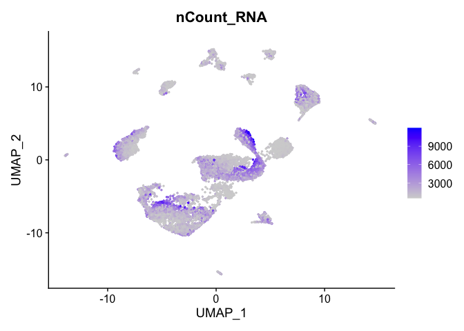
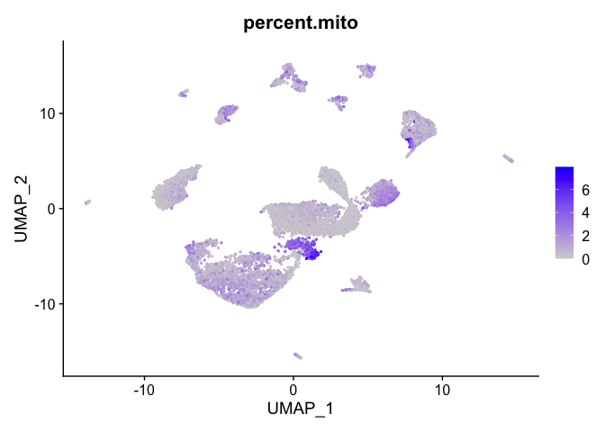
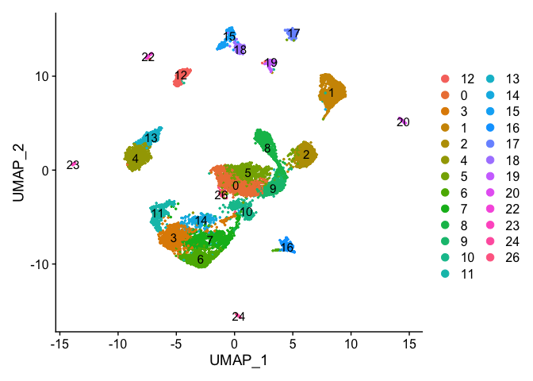
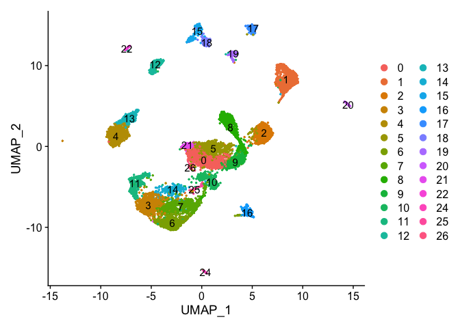
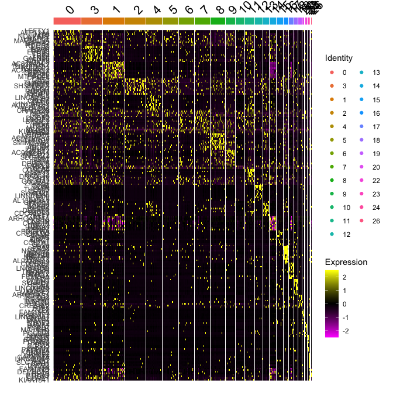
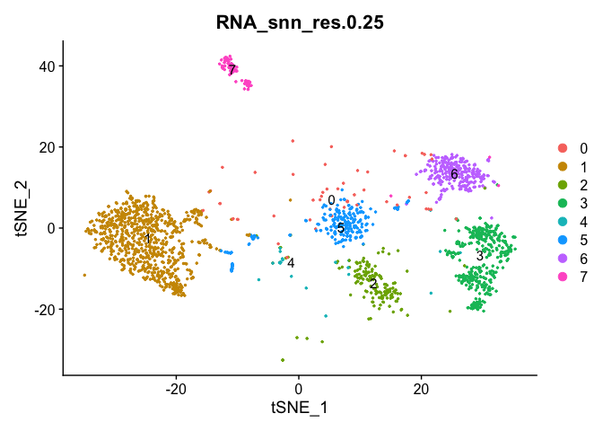

Last Updated: March 24 2021, 5pm

# Part 5: 

## Load libraries

```r
library(Seurat)
library(ggplot2)
library(dplyr)
```

## Load the Seurat object

```r
load(file="pca_sample_corrected.RData")
experiment.aggregate
```

<div class='r_output'> An object of class Seurat 
 36601 features across 4000 samples within 1 assay 
 Active assay: RNA (36601 features, 3783 variable features)
  1 dimensional reduction calculated: pca
</div>

## So how many features should we use? Use too few and your leaving out interesting variation that may define cell types, use too many and you add in noise? maybe?

Lets choose the first 50, based on our prior part.


```r
use.pcs = 1:50
```

## Identifying clusters

Seurat implements an graph-based clustering approach. Distances between the cells are calculated based on previously identified PCs. 

The default method for identifying k-nearest neighbors has been changed in V4 to [annoy](https://github.com/spotify/annoy) ("Approximate Nearest Neighbors Oh Yeah!). This is an approximate nearest-neighbor approach that is widely used for high-dimensional analysis in many fields, including single-cell analysis. Extensive community benchmarking has shown that annoy substantially improves the speed and memory requirements of neighbor discovery, with negligible impact to downstream results. 


Seurat prior approach was heavily inspired by recent manuscripts which applied graph-based clustering approaches to scRNAseq data. Briefly, Seurat identified clusters of cells by a shared nearest neighbor (SNN) modularity optimization based clustering algorithm. First calculate k-nearest neighbors (KNN) and construct the SNN graph. Then optimize the modularity function to determine clusters. For a full description of the algorithms, see Waltman and van Eck (2013) The European Physical Journal B. You can switch back to using the previous default setting using nn.method="rann".


The FindClusters function implements the neighbor based clustering procedure, and contains a resolution parameter that sets the granularity of the downstream clustering, with increased values leading to a greater number of clusters. I tend to like to perform a series of resolutions, investigate and choose.


```r
?FindNeighbors
```


```r
experiment.aggregate <- FindNeighbors(experiment.aggregate, reduction="pca", dims = use.pcs)

experiment.aggregate <- FindClusters(
    object = experiment.aggregate,
    resolution = seq(0.25,4,0.5),
    verbose = FALSE
)
```


Seurat add the clustering information to the metadata beginning with RNA_snn_res. followed by the resolution


```r
head(experiment.aggregate[[]])
```

<div class='r_output'>                        orig.ident nCount_RNA nFeature_RNA batchid percent.mito
 CCGTTCAAGGTGACCA-PBMC2      PBMC2       1533         1004  Batch1     4.044357
 ATTGGTGTCGGTTCGG-PBMC2      PBMC2       1225          834  Batch1     7.673469
 GTAGGCCTCTATCCTA-PBMC2      PBMC2       1109          806  Batch1     4.418395
 CATTATCCAGGCAGTA-PBMC2      PBMC2       1949         1226  Batch1     7.439713
 CTGGTCTTCCAAATGC-PBMC2      PBMC2       3074         1303  Batch1     2.374756
 AGCTTGAGTTGTGGAG-PBMC2      PBMC2       1028          748  Batch1     3.599222
                             S.Score   G2M.Score Phase old.ident
 CCGTTCAAGGTGACCA-PBMC2 -0.009757111  0.05114394   G2M     PBMC2
 ATTGGTGTCGGTTCGG-PBMC2 -0.006619531  0.02301644   G2M     PBMC2
 GTAGGCCTCTATCCTA-PBMC2  0.019239276 -0.02686039     S     PBMC2
 CATTATCCAGGCAGTA-PBMC2 -0.077384425  0.04775564   G2M     PBMC2
 CTGGTCTTCCAAATGC-PBMC2  0.032593746 -0.01541937     S     PBMC2
 AGCTTGAGTTGTGGAG-PBMC2 -0.051954726 -0.01295370    G1     PBMC2
                        RNA_snn_res.0.25 RNA_snn_res.0.75 RNA_snn_res.1.25
 CCGTTCAAGGTGACCA-PBMC2                2                9                9
 ATTGGTGTCGGTTCGG-PBMC2                4                3                3
 GTAGGCCTCTATCCTA-PBMC2                5                6                7
 CATTATCCAGGCAGTA-PBMC2                2                9                9
 CTGGTCTTCCAAATGC-PBMC2                6                5                6
 AGCTTGAGTTGTGGAG-PBMC2                5                6                7
                        RNA_snn_res.1.75 RNA_snn_res.2.25 RNA_snn_res.2.75
 CCGTTCAAGGTGACCA-PBMC2               11               13               12
 ATTGGTGTCGGTTCGG-PBMC2                3                2               20
 GTAGGCCTCTATCCTA-PBMC2                7                8                8
 CATTATCCAGGCAGTA-PBMC2               11               13               12
 CTGGTCTTCCAAATGC-PBMC2                6                6                5
 AGCTTGAGTTGTGGAG-PBMC2                7                8                8
                        RNA_snn_res.3.25 RNA_snn_res.3.75 seurat_clusters
 CCGTTCAAGGTGACCA-PBMC2               12               11              11
 ATTGGTGTCGGTTCGG-PBMC2               23               25              25
 GTAGGCCTCTATCCTA-PBMC2                8                8               8
 CATTATCCAGGCAGTA-PBMC2               12               11              11
 CTGGTCTTCCAAATGC-PBMC2                5                4               4
 AGCTTGAGTTGTGGAG-PBMC2                8                8               8
</div>

Lets first investigate how many clusters each resolution produces and set it to the smallest resolutions of 0.5 (fewest clusters).


```r
sapply(grep("res",colnames(experiment.aggregate@meta.data),value = TRUE),
       function(x) length(unique(experiment.aggregate@meta.data[,x])))
```

<div class='r_output'> RNA_snn_res.0.25 RNA_snn_res.0.75 RNA_snn_res.1.25 RNA_snn_res.1.75 
                9               15               16               19 
 RNA_snn_res.2.25 RNA_snn_res.2.75 RNA_snn_res.3.25 RNA_snn_res.3.75 
               21               24               26               29
</div>
### Plot TSNE coloring for each resolution

tSNE dimensionality reduction plots are then used to visualize clustering results. As input to the tSNE, you should use the same PCs as input to the clustering analysis.


```r
experiment.aggregate <- RunTSNE(
  object = experiment.aggregate,
  reduction.use = "pca",
  dims = use.pcs,
  do.fast = TRUE)
```


```r
DimPlot(object = experiment.aggregate, group.by=grep("res",colnames(experiment.aggregate@meta.data),value = TRUE)[1:4], ncol=2 , pt.size=3.0, reduction = "tsne", label = T)
```

<!-- -->


```r
DimPlot(object = experiment.aggregate, group.by=grep("res",colnames(experiment.aggregate@meta.data),value = TRUE)[5:8], ncol=2 , pt.size=3.0, reduction = "tsne", label = T)
```

<!-- -->

1. Try exploring different PCS, so first 5, 15, 25, we used 50, what about 100? How does the clustering change?

Once complete go back to 1:50

### Choosing a resolution

Lets set the default identity to a resolution of 0.25 and produce a table of cluster to sample assignments.

```r
Idents(experiment.aggregate) <- "RNA_snn_res.1.25"
table(Idents(experiment.aggregate),experiment.aggregate$orig.ident)
```

<div class='r_output'>     
      PBMC2 PBMC3 T021PBMC T022PBMC
   0     19    19      341       90
   1     43   403        3        7
   2      9     0       15      431
   3      7    15      284       49
   4     15   315       10        5
   5      7     2       76      219
   6    247    13        2        0
   7    203     2        0        6
   8     12   179        2       13
   9    150     6       30       18
   10    73    10       92       29
   11   171    12        1        0
   12     0     0       37       99
   13     6     0       87        5
   14    33    24        2        3
   15     5     0       18       26
</div>
Plot TSNE coloring by the slot 'ident' (default).

```r
DimPlot(object = experiment.aggregate, pt.size=0.5, reduction = "tsne", label = T)
```

<!-- -->


### uMAP dimensionality reduction plot.


```r
experiment.aggregate <- RunUMAP(
  object = experiment.aggregate,
  dims = use.pcs)
```

Plot uMap coloring by the slot 'ident' (default).

```r
DimPlot(object = experiment.aggregate, pt.size=0.5, reduction = "umap", label = T)
```

<!-- -->

Catagorical data can be plotted using the DimPlot function.


TSNE plot by cell cycle

```r
DimPlot(object = experiment.aggregate, pt.size=0.5, group.by = "Phase", reduction = "umap" )
```

<!-- -->

1. Try creating a table, of cluster x cell cycle

### Can use feature plot to plot our read valued metadata, like nUMI, Feature count, and percent Mito
FeaturePlot can be used to color cells with a 'feature', non categorical data, like number of UMIs

```r
FeaturePlot(experiment.aggregate, features = c('nCount_RNA'), pt.size=0.5)
```

<!-- -->
and number of genes present

```r
FeaturePlot(experiment.aggregate, features = c('nFeature_RNA'), pt.size=0.5)
```

<!-- -->

percent mitochondrial

```r
FeaturePlot(experiment.aggregate, features = c('percent.mito'), pt.size=0.5)
```

<!-- -->

## Building a phylogenetic tree relating the 'average' cell from each group in default 'Ident' (currently "RNA_snn_res.0.25"). Tree is estimated based on a distance matrix constructed in either gene expression space or PCA space.


```r
Idents(experiment.aggregate) <- "RNA_snn_res.0.25"
experiment.aggregate <- BuildClusterTree(
  experiment.aggregate, dims = use.pcs)

PlotClusterTree(experiment.aggregate)
```

<!-- -->
1. Create new trees of other data

Once complete go back to Res 0.25


```r
DimPlot(object = experiment.aggregate, pt.size=0.5, label = TRUE, reduction = "umap")
```

<!-- -->

### Merging clusters

Merge Clustering results, so lets say clusters 3 and 7 are actually the same cell type (overlaps in the tsne, not as apparent in the umap) and we don't wish to separate them out as distinct clusters. Same with 4 and 5.


```r
experiment.merged = experiment.aggregate
Idents(experiment.merged) <- "RNA_snn_res.0.25"

experiment.merged <- RenameIdents(
  object = experiment.merged,
  '3' = '7', '4' = '5'
)

table(Idents(experiment.merged))
```

<div class='r_output'> 
    7    5    0    1    2    6    8 
  595  627 1024  803  552  265  134
</div>
```r
DimPlot(object = experiment.merged, pt.size=0.5, label = T, reduction = "umap")
```

<!-- -->

```r
VlnPlot(object = experiment.merged, features = "percent.mito", pt.size = 0.05)
```

<!-- -->

### Reording the clusters

In order to reorder the clusters for plotting purposes take a look at the levels of the Ident, which indicates the ordering, then relevel as desired.


```r
experiment.examples <- experiment.merged
levels(experiment.examples@active.ident)
```

<div class='r_output'> [1] "7" "5" "0" "1" "2" "6" "8"
</div>
```r
experiment.examples@active.ident <- relevel(experiment.examples@active.ident, "6")
levels(experiment.examples@active.ident)
```

<div class='r_output'> [1] "6" "7" "5" "0" "1" "2" "8"
</div>
```r
# now cluster 6 is the "first" factor

DimPlot(object = experiment.examples, pt.size=0.5, label = T, reduction = "umap")
```

<!-- -->

```r
VlnPlot(object = experiment.examples, features = "percent.mito", pt.size = 0.05)
```

<!-- -->


```r
# relevel all the factors to the order I want
Idents(experiment.examples) <- factor(experiment.examples@active.ident, levels=c("6","2","0","7","5","9","1","8"))
levels(experiment.examples@active.ident)
```

<div class='r_output'> [1] "6" "2" "0" "7" "5" "1" "8"
</div>
```r
DimPlot(object = experiment.examples, pt.size=0.5, label = T, reduction = "umap")
```

<!-- -->


### Re-assign clustering result (subclustering only cluster 0) to clustering for resolution 3.75  (@ reslution 0.25) [adding a R prefix]

```r
newIdent = as.character(Idents(experiment.examples))
newIdent[newIdent == '0'] = paste0("R",as.character(experiment.examples$RNA_snn_res.3.75[newIdent == '0']))

Idents(experiment.examples) <- as.factor(newIdent)
table(Idents(experiment.examples))
```

<div class='r_output'> 
   1   2   5   6   7   8  R0 R13 R15 R16 R19  R2 R24 R28  R7 
 803 552 627 265 595 134 337   1 111   4   4 297  41   3 226
</div>

```r
DimPlot(object = experiment.examples, pt.size=0.5, label = T, reduction = "umap")
```

<!-- -->

Plot UMAP  coloring by the slot 'orig.ident' (sample names) with alpha colors turned on. A pretty picture

```r
DimPlot(object = experiment.aggregate, group.by="orig.ident", pt.size=0.5, reduction = "umap" )
```

<!-- -->


```r
## Pretty umap using alpha
alpha.use <- 2/5
p <- DimPlot(object = experiment.aggregate, group.by="orig.ident", pt.size=0.5, reduction = "umap")
p$layers[[1]]$mapping$alpha <- alpha.use
p + scale_alpha_continuous(range = alpha.use, guide = F)
```

<!-- -->

Removing cells assigned to clusters from a plot, So here plot all clusters but cluster 6 (contaminant?)

```r
# create a new tmp object with those removed
experiment.aggregate.tmp <- experiment.aggregate[,-which(Idents(experiment.aggregate) %in% c("6"))]

dim(experiment.aggregate)
```

<div class='r_output'> [1] 36601  4000
</div>
```r
dim(experiment.aggregate.tmp)
```

<div class='r_output'> [1] 36601  3735
</div>


```r
DimPlot(object = experiment.aggregate.tmp, pt.size=0.5, reduction = "umap", label = T)
```

<!-- -->

## Identifying Marker Genes

Seurat can help you find markers that define clusters via differential expression.

`FindMarkers` identifies markers for a cluster relative to all other clusters.

`FindAllMarkers` does so for all clusters

`FindAllMarkersNode` defines all markers that split a Node from the cluster tree


```r
?FindMarkers
```


```r
markers = FindMarkers(experiment.aggregate, ident.1=c(3,7), ident.2 = c(4,5))

head(markers)
```

<div class='r_output'>               p_val avg_log2FC pct.1 pct.2     p_val_adj
 RPL13 6.509849e-128   1.266628 0.993 0.941 2.382670e-123
 RPS5  5.564534e-107   1.375955 0.966 0.740 2.036675e-102
 RPS19 8.747659e-104   1.214465 0.985 0.860  3.201731e-99
 RPS8  5.925264e-102   1.128725 0.993 0.901  2.168706e-97
 RPL29  3.151857e-93   1.075348 0.982 0.829  1.153611e-88
 RPS18  3.693614e-93   1.170980 0.985 0.871  1.351900e-88
</div>
```r
dim(markers)
```

<div class='r_output'> [1] 1509    5
</div>
```r
table(markers$avg_log2FC > 0)
```

<div class='r_output'> 
 FALSE  TRUE 
  1002   507
</div>
```r
table(markers$p_val_adj < 0.05 & markers$avg_log2FC > 0)
```

<div class='r_output'> 
 FALSE  TRUE 
  1130   379
</div>

pct.1 and pct.2 are the proportion of cells with expression above 0 in ident.1 and ident.2 respectively. p_val is the raw p_value associated with the differntial expression test with adjusted value in p_val_adj. avg_logFC is the average log fold change difference between the two groups.

avg_diff (lines 130, 193 and) appears to be the difference in log(x = mean(x = exp(x = x) - 1) + 1) between groups.  It doesn’t seem like this should work out to be the signed ratio of pct.1 to pct.2 so I must be missing something.  It doesn’t seem to be related at all to how the p-values are calculated so maybe it doesn’t matter so much, and the sign is probably going to be pretty robust to how expression is measured.

Can use a violin plot to visualize the expression pattern of some markers

```r
VlnPlot(object = experiment.aggregate, features = rownames(markers)[1:2], pt.size = 0.05)
```

<!-- -->

Or a feature plot

```r
FeaturePlot(
    experiment.aggregate,
    "KLRD1",
    cols = c("lightgrey", "blue"),
    ncol = 2
)
```

<!-- -->

FindAllMarkers can be used to automate the process across all genes.


```r
markers_all <- FindAllMarkers(
    object = experiment.merged,
    only.pos = TRUE,
    min.pct = 0.25,
    thresh.use = 0.25
)
dim(markers_all)
```

<div class='r_output'> [1] 4031    7
</div>
```r
head(markers_all)
```

<div class='r_output'>                   p_val avg_log2FC pct.1 pct.2     p_val_adj cluster      gene
 MS4A1     7.868239e-202   2.460640 0.333 0.014 2.879854e-197       7     MS4A1
 LINC00926 1.243988e-201   1.881382 0.292 0.005 4.553122e-197       7 LINC00926
 CD79A     2.998365e-173   2.941748 0.336 0.024 1.097432e-168       7     CD79A
 BANK1     2.474993e-155   1.334570 0.255 0.009 9.058720e-151       7     BANK1
 IGHM      1.796692e-143   1.835100 0.289 0.021 6.576072e-139       7      IGHM
 AFF3      6.026634e-129   1.291855 0.257 0.018 2.205808e-124       7      AFF3
</div>
```r
table(table(markers_all$gene))
```

<div class='r_output'> 
    1    2    3    4 
 1371 1049  178    7
</div>
```r
markers_all_single <- markers_all[markers_all$gene %in% names(table(markers_all$gene))[table(markers_all$gene) == 1],]

dim(markers_all_single)
```

<div class='r_output'> [1] 1371    7
</div>
```r
table(table(markers_all_single$gene))
```

<div class='r_output'> 
    1 
 1371
</div>
```r
table(markers_all_single$cluster)
```

<div class='r_output'> 
   7   5   0   1   2   6   8 
  45  24 151 325 520  70 236
</div>
```r
head(markers_all_single)
```

<div class='r_output'>                   p_val avg_log2FC pct.1 pct.2     p_val_adj cluster      gene
 MS4A1     7.868239e-202   2.460640 0.333 0.014 2.879854e-197       7     MS4A1
 LINC00926 1.243988e-201   1.881382 0.292 0.005 4.553122e-197       7 LINC00926
 CD79A     2.998365e-173   2.941748 0.336 0.024 1.097432e-168       7     CD79A
 BANK1     2.474993e-155   1.334570 0.255 0.009 9.058720e-151       7     BANK1
 IGHM      1.796692e-143   1.835100 0.289 0.021 6.576072e-139       7      IGHM
 AFF3      6.026634e-129   1.291855 0.257 0.018 2.205808e-124       7      AFF3
</div>
Plot a heatmap of genes by cluster for the top 10 marker genes per cluster

```r
top10 <- markers_all_single %>% group_by(cluster) %>% top_n(10, avg_log2FC)
DoHeatmap(
    object = experiment.merged,
    features = top10$gene
)
```

<!-- -->


```r
# Get expression of genes for cells in and out of each cluster
getGeneClusterMeans <- function(gene, cluster){
  x <- GetAssayData(experiment.merged)[gene,]
  m <- tapply(x, ifelse(Idents(experiment.merged) == cluster, 1, 0), mean)
  mean.in.cluster <- m[2]
  mean.out.of.cluster <- m[1]
  return(list(mean.in.cluster = mean.in.cluster, mean.out.of.cluster = mean.out.of.cluster))
}

## for sake of time only using first six (head)
means <- mapply(getGeneClusterMeans, head(markers_all[,"gene"]), head(markers_all[,"cluster"]))
means <- matrix(unlist(means), ncol = 2, byrow = T)

colnames(means) <- c("mean.in.cluster", "mean.out.of.cluster")
rownames(means) <- head(markers_all[,"gene"])
markers_all2 <- cbind(head(markers_all), means)
head(markers_all2)
```

<div class='r_output'>                   p_val avg_log2FC pct.1 pct.2     p_val_adj cluster      gene
 MS4A1     7.868239e-202   2.460640 0.333 0.014 2.879854e-197       7     MS4A1
 LINC00926 1.243988e-201   1.881382 0.292 0.005 4.553122e-197       7 LINC00926
 CD79A     2.998365e-173   2.941748 0.336 0.024 1.097432e-168       7     CD79A
 BANK1     2.474993e-155   1.334570 0.255 0.009 9.058720e-151       7     BANK1
 IGHM      1.796692e-143   1.835100 0.289 0.021 6.576072e-139       7      IGHM
 AFF3      6.026634e-129   1.291855 0.257 0.018 2.205808e-124       7      AFF3
           mean.in.cluster mean.out.of.cluster
 MS4A1           0.8339190         0.020402330
 LINC00926       0.6112367         0.008039788
 CD79A           0.9998699         0.034222701
 BANK1           0.4698104         0.012849977
 IGHM            0.6230881         0.033921560
 AFF3            0.4629120         0.023382292
</div>
## Finishing up clusters.

At this point in time you should use the tree, markers, domain knowledge, and goals to finalize your clusters. This may mean adjusting PCA to use, mergers clusters together, choosing a new resolutions, etc. When finished you can further name it cluster by something more informative. Ex.

```r
experiment.clusters <- experiment.aggregate
experiment.clusters <- RenameIdents(
  object = experiment.clusters,
  '0' = 'cell_type_A',
  '1' = 'cell_type_B',
  '2' = 'cell_type_C'
)
# and so on

DimPlot(object = experiment.clusters, pt.size=0.5, label = T, reduction = "tsne")
```

<!-- -->

Right now our results ONLY exist in the Ident data object, lets save it to our metadata table so we don't accidentally loose it.

```r
experiment.merged$finalcluster <- Idents(experiment.merged)
head(experiment.merged[[]])
```

<div class='r_output'>                        orig.ident nCount_RNA nFeature_RNA batchid percent.mito
 CCGTTCAAGGTGACCA-PBMC2      PBMC2       1533         1004  Batch1     4.044357
 ATTGGTGTCGGTTCGG-PBMC2      PBMC2       1225          834  Batch1     7.673469
 GTAGGCCTCTATCCTA-PBMC2      PBMC2       1109          806  Batch1     4.418395
 CATTATCCAGGCAGTA-PBMC2      PBMC2       1949         1226  Batch1     7.439713
 CTGGTCTTCCAAATGC-PBMC2      PBMC2       3074         1303  Batch1     2.374756
 AGCTTGAGTTGTGGAG-PBMC2      PBMC2       1028          748  Batch1     3.599222
                             S.Score   G2M.Score Phase old.ident
 CCGTTCAAGGTGACCA-PBMC2 -0.009757111  0.05114394   G2M     PBMC2
 ATTGGTGTCGGTTCGG-PBMC2 -0.006619531  0.02301644   G2M     PBMC2
 GTAGGCCTCTATCCTA-PBMC2  0.019239276 -0.02686039     S     PBMC2
 CATTATCCAGGCAGTA-PBMC2 -0.077384425  0.04775564   G2M     PBMC2
 CTGGTCTTCCAAATGC-PBMC2  0.032593746 -0.01541937     S     PBMC2
 AGCTTGAGTTGTGGAG-PBMC2 -0.051954726 -0.01295370    G1     PBMC2
                        RNA_snn_res.0.25 RNA_snn_res.0.75 RNA_snn_res.1.25
 CCGTTCAAGGTGACCA-PBMC2                2                9                9
 ATTGGTGTCGGTTCGG-PBMC2                4                3                3
 GTAGGCCTCTATCCTA-PBMC2                5                6                7
 CATTATCCAGGCAGTA-PBMC2                2                9                9
 CTGGTCTTCCAAATGC-PBMC2                6                5                6
 AGCTTGAGTTGTGGAG-PBMC2                5                6                7
                        RNA_snn_res.1.75 RNA_snn_res.2.25 RNA_snn_res.2.75
 CCGTTCAAGGTGACCA-PBMC2               11               13               12
 ATTGGTGTCGGTTCGG-PBMC2                3                2               20
 GTAGGCCTCTATCCTA-PBMC2                7                8                8
 CATTATCCAGGCAGTA-PBMC2               11               13               12
 CTGGTCTTCCAAATGC-PBMC2                6                6                5
 AGCTTGAGTTGTGGAG-PBMC2                7                8                8
                        RNA_snn_res.3.25 RNA_snn_res.3.75 seurat_clusters
 CCGTTCAAGGTGACCA-PBMC2               12               11              11
 ATTGGTGTCGGTTCGG-PBMC2               23               25              25
 GTAGGCCTCTATCCTA-PBMC2                8                8               8
 CATTATCCAGGCAGTA-PBMC2               12               11              11
 CTGGTCTTCCAAATGC-PBMC2                5                4               4
 AGCTTGAGTTGTGGAG-PBMC2                8                8               8
                        finalcluster
 CCGTTCAAGGTGACCA-PBMC2            2
 ATTGGTGTCGGTTCGG-PBMC2            5
 GTAGGCCTCTATCCTA-PBMC2            5
 CATTATCCAGGCAGTA-PBMC2            2
 CTGGTCTTCCAAATGC-PBMC2            6
 AGCTTGAGTTGTGGAG-PBMC2            5
</div>
## Subsetting samples and plotting

If you want to look at the representation of just one sample, or sets of samples

```r
experiment.sample2 <- subset(experiment.merged, orig.ident == "T021PBMC")

DimPlot(object = experiment.sample2, group.by = "RNA_snn_res.0.25", pt.size=0.5, label = TRUE, reduction = "tsne")
```

<!-- -->

```r
experiment.batch1 <- subset(experiment.merged, batchid == "Batch1")

DimPlot(object = experiment.batch1, group.by = "RNA_snn_res.0.25", pt.size=0.5, label = TRUE, reduction = "tsne")
```

<!-- -->

### Adding in a new metadata column representing samples within clusters. So differential expression of PBMC2 vs PBMC3 within cluster 7


```r
experiment.merged$samplecluster = paste(experiment.merged$orig.ident,experiment.merged$finalcluster,sep = '-')

# set the identity to the new variable
Idents(experiment.merged) <- "samplecluster"

markers.comp <- FindMarkers(experiment.merged, ident.1 = c("PBMC2-7","PBMC3-7"), ident.2= "PBMC2-5")

head(markers.comp)
```

<div class='r_output'>               p_val avg_log2FC pct.1 pct.2    p_val_adj
 RPS19  4.133527e-86   2.281703 0.983 0.725 1.512912e-81
 RPL28  2.638843e-85   2.088881 0.987 0.749 9.658429e-81
 RPS3   4.573010e-83   1.877041 0.993 0.814 1.673767e-78
 RPS27  5.062436e-83   1.947372 0.991 0.870 1.852902e-78
 RPL13  6.204595e-82   1.776009 0.991 0.931 2.270944e-77
 TMSB10 2.145713e-80   1.909817 0.985 0.846 7.853524e-76
</div>
```r
experiment.subset <- subset(experiment.merged, samplecluster %in%  c( "PBMC2-7", "PBMC3-7" ))
DoHeatmap(experiment.subset, features = head(rownames(markers.comp),20))
```

<!-- -->


```r
Idents(experiment.merged) <- "finalcluster"
```

And last lets save all the objects in our session.

```r
save(list=ls(), file="clusters_seurat_object.RData")
```

## Get the next Rmd file

```r
download.file("https://raw.githubusercontent.com/ucdavis-bioinformatics-training/2021-August-Single-Cell-RNA-Seq-Analysis/master/data_analysis/scRNA_Workshop-PART6.Rmd", "scRNA_Workshop-PART6.Rmd")
```

## Session Information

```r
sessionInfo()
```

<div class='r_output'> R version 4.0.3 (2020-10-10)
 Platform: x86_64-apple-darwin17.0 (64-bit)
 Running under: macOS Big Sur 10.16
 
 Matrix products: default
 BLAS:   /Library/Frameworks/R.framework/Versions/4.0/Resources/lib/libRblas.dylib
 LAPACK: /Library/Frameworks/R.framework/Versions/4.0/Resources/lib/libRlapack.dylib
 
 locale:
 [1] en_US.UTF-8/en_US.UTF-8/en_US.UTF-8/C/en_US.UTF-8/en_US.UTF-8
 
 attached base packages:
 [1] stats     graphics  grDevices utils     datasets  methods   base     
 
 other attached packages:
 [1] dplyr_1.0.5        ggplot2_3.3.3      SeuratObject_4.0.0 Seurat_4.0.1      
 
 loaded via a namespace (and not attached):
   [1] Rtsne_0.15            colorspace_2.0-0      deldir_0.2-10        
   [4] ellipsis_0.3.1        ggridges_0.5.3        spatstat.data_2.1-0  
   [7] leiden_0.3.7          listenv_0.8.0         farver_2.1.0         
  [10] ggrepel_0.9.1         RSpectra_0.16-0       fansi_0.4.2          
  [13] codetools_0.2-18      splines_4.0.3         knitr_1.31           
  [16] polyclip_1.10-0       jsonlite_1.7.2        ica_1.0-2            
  [19] cluster_2.1.1         png_0.1-7             uwot_0.1.10          
  [22] shiny_1.6.0           sctransform_0.3.2     spatstat.sparse_2.0-0
  [25] compiler_4.0.3        httr_1.4.2            assertthat_0.2.1     
  [28] Matrix_1.3-2          fastmap_1.1.0         lazyeval_0.2.2       
  [31] limma_3.44.3          later_1.1.0.1         htmltools_0.5.1.1    
  [34] tools_4.0.3           igraph_1.2.6          gtable_0.3.0         
  [37] glue_1.4.2            RANN_2.6.1            reshape2_1.4.4       
  [40] Rcpp_1.0.6            scattermore_0.7       jquerylib_0.1.3      
  [43] vctrs_0.3.6           ape_5.4-1             nlme_3.1-152         
  [46] lmtest_0.9-38         xfun_0.22             stringr_1.4.0        
  [49] globals_0.14.0        mime_0.10             miniUI_0.1.1.1       
  [52] lifecycle_1.0.0       irlba_2.3.3           goftest_1.2-2        
  [55] future_1.21.0         MASS_7.3-53.1         zoo_1.8-9            
  [58] scales_1.1.1          spatstat.core_2.0-0   promises_1.2.0.1     
  [61] spatstat.utils_2.1-0  parallel_4.0.3        RColorBrewer_1.1-2   
  [64] yaml_2.2.1            reticulate_1.18       pbapply_1.4-3        
  [67] gridExtra_2.3         sass_0.3.1            rpart_4.1-15         
  [70] stringi_1.5.3         highr_0.8             rlang_0.4.10         
  [73] pkgconfig_2.0.3       matrixStats_0.58.0    evaluate_0.14        
  [76] lattice_0.20-41       ROCR_1.0-11           purrr_0.3.4          
  [79] tensor_1.5            patchwork_1.1.1       htmlwidgets_1.5.3    
  [82] labeling_0.4.2        cowplot_1.1.1         tidyselect_1.1.0     
  [85] parallelly_1.24.0     RcppAnnoy_0.0.18      plyr_1.8.6           
  [88] magrittr_2.0.1        R6_2.5.0              generics_0.1.0       
  [91] DBI_1.1.1             pillar_1.5.1          withr_2.4.1          
  [94] mgcv_1.8-34           fitdistrplus_1.1-3    survival_3.2-10      
  [97] abind_1.4-5           tibble_3.1.0          future.apply_1.7.0   
 [100] crayon_1.4.1          KernSmooth_2.23-18    utf8_1.2.1           
 [103] spatstat.geom_2.0-1   plotly_4.9.3          rmarkdown_2.7        
 [106] grid_4.0.3            data.table_1.14.0     digest_0.6.27        
 [109] xtable_1.8-4          tidyr_1.1.3           httpuv_1.5.5         
 [112] munsell_0.5.0         viridisLite_0.3.0     bslib_0.2.4
</div>